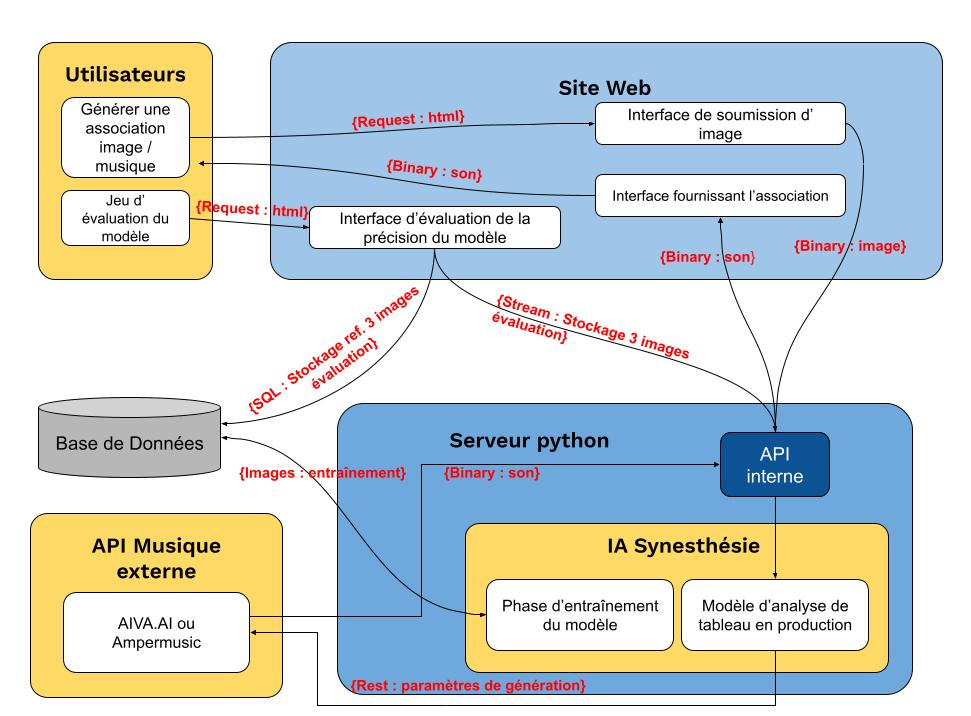

=== Schéma d’architecture

==== Description des blocs

===== Site Web

Notre projet repose sur un site web pour interagir avec les utilisateurs. C’est dans ce site web que les utilisateurs pourront importer leur tableau et écouter la musique associée. +
Nous souhaitons programmer le site en utilisant un Frontend JavaScript et HTML + CSS, potentiellement via Bootstrap et un Backend en PhP + SQL. 
Nos objectifs pour le site sont de :
- Réaliser une où plusieurs pages présentant le projet +
- Programmer une interface pour permettre a l'utilisateur d'utiliser l'IA sur une image arbitraire+
- Programmer un jeu où l'utilisateur doit retrouver en écoutant une musique le tableau qui l'a généré parmi d'autres de façon a estimer la pertinence de notre sytème. +

Nous pensons qu'il n'y aura pas besoin d'une interface pour un accès administrateur. En effet, nous aurons un accès direct à la base de donnée et au serveur de calcul python.

===== Serveur Python / API interne

Le site web ne sera que la façade du projet et nous souhaitons programmer l'IA en python de façon à pouvoir exploiter l'écosystème qui y existe (TensorFlow, Keras,...), bien plus mature que celui d'autre langages. Un serveur python sera donc responsable de la gestion de l'intelligence artificielle et de la pipeline allant de l'image à la musique. +

Pour pouvoir faire communiquer le site et l'IA, une API interne au projet sera également développée au sein du module "API"  pour le serveur python afin d'interfaçer les deux écosystèmes. +

Les objectifs seront donc : 
- créer un API fonctionnelle pour accéder aux fonction du serveur +
- paramétrer un serveur capable de répondre à tout moments aux appels de l'API +
- pouvoir accéder aux fonctions de l'API à partir du site. 

===== Classification de tableaux

Afin de permettre la classification des tableaux selon différents critères, nous allons séparer le travail en deux niveaux. Traitement d'images puis classification des images à l'aide de l'IA. +

Le module "traitement d'image" proposé par Michel Roux permettra de développer plusieurs algorithmes en Python pour traiter et analyser le contenu pictural des tableaux de la base de données. Le contenu analysé sera la couleur et la texture du tableau.  +

Nous souhaiterions développer lors de ce module plusieurs algorithmes que nous pourrions ensuite assembler de façon a obtenir les meilleurs résultats: +
- Un filtre permettant d'améliorer les images de tableau de la base de donnée que l'on utilisera, en supprimant des imperfections comme les reflets, l'angle de la photograĥie, le mouvement du photographe et qui redimensionne l'image vers une résolution fixée. +
- Un algorithme qui récupère une image de la texture 3D d'un tableau 2D mis en entrée afin de pouvoir le classifier plus aisément (à partir des ombres par exemple). +
- Un algorithme prenant en entrée deux photograpies de deux tableaux et qui calcule une "distance" entre ces deux tableaux en fonction de leur spectres et textures, afin de rapprocher les tableaux à des contenus picturaux proches.
